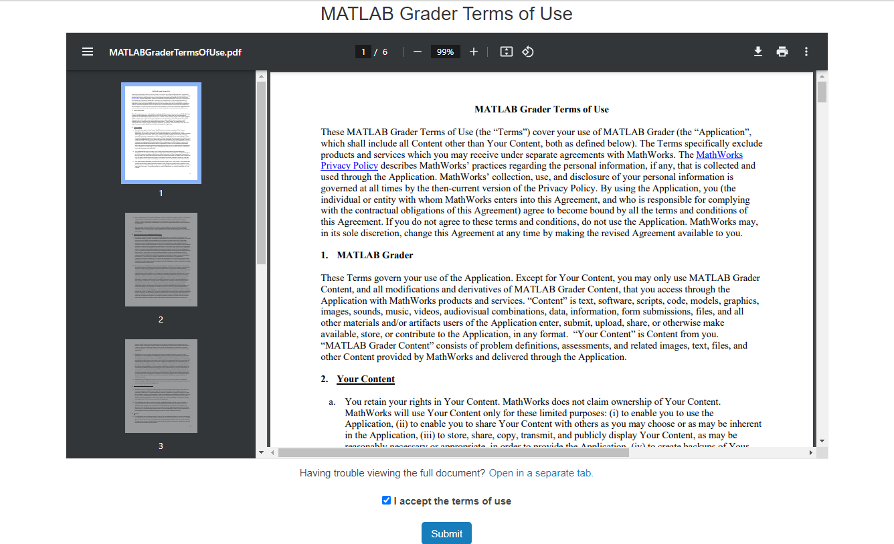

# MATLAB Grader
MATLAB's Grader is a tool that enables educators to create, manage, and automatically grade MATLAB-based assignments, providing immediate feedback to students. 

## Set Up an Autograder
1. Navigate to grader.mathworks.com
2. You'll be asked to accept the terms of conditions first. 

3. 

## Helpful Links
[MATLAB Grader Tour](https://www.mathworks.com/videos/matlab-grader-overview-1532608334621.html)
[MATLAB Grader Documentation](https://www.mathworks.com/help/matlabgrader/index.html)
[Teaching with MATLAB Course](https://www.mathworks.com/learn/teaching-with-matlab.html)